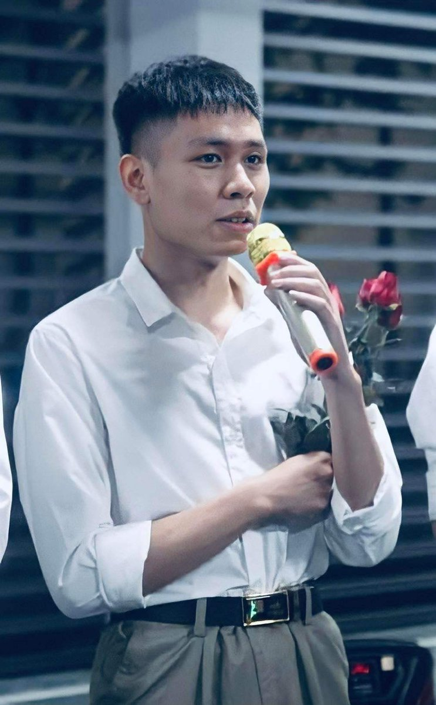
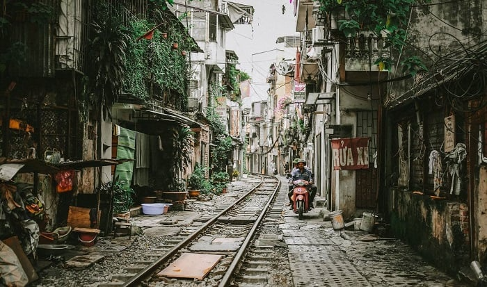

# CS50’s Introduction to Programming with Python - Final project
# Transform the image with artistic effects!

## Video Demo:  https://www.youtube.com/watch?v=pi3sYiuFmEE

## Description

    This program utilizes various image processing techniques to modify original images and produce aesthetically pleasing results.

    With this versatile image editing tool, you can effortlessly transform your photos into captivating works of art. Whether you seek the ethereal beauty of a reflected image, the timeless elegance of grayscale, the nostalgic warmth of sepia, or the artistic charm of a pencil sketch, this tool has you covered. For a touch of mystery, blur the edges of your image or remove the background entirely. To create a striking contrast, convert your photo to a negative, or for a vintage feel, apply the vintage effect. If you prefer a brighter, fresher look, the fresh effect is ideal. And if you want to emphasize the outlines of your subject, the edges effect is perfect. Finally, for a subtle, muted effect, try the bland filter. With this tool's endless possibilities, the only limit is your imagination.

## Feature
    1. Check valid command-line arguments.
    2. Create image variable.
    3. Check valid input file.
    4. Save or save and show

## Files & Directories

### main
    - project.py
    - README.md
    - requirements.txt
    - test_project.py
    - BoyModel.jpeg
    - GirlModel.jpep
    - Landscape.jpg
    - newBoyModel.jpeg
    - newGirlModel.jpep
    - newLandscape.jpg
 

### images
    All images of this README.md

## Implementation

### Check comman-line argument

    Let's fire up the terminal and issue some commands.

    Entering less than three characters, excluding 'python', in the terminal window will trigger this output:

    Entering more than three characters, excluding 'python', in the terminal window will generate this output:

    Entering exactly three characters will result in an error if the input or ouput or both is incorrect.

    Or input file is not available

    To produce correct output, enter exactly three characters, excluding 'python', and provide valid files with compatible extensions.

### Converting

    Upon entering valid input, this message will be displayed.:

    Typing an invalid effect will result in an error message like this to prompt the user to choose a valid effect:

    Upon selecting an effect, this message will be displayed:

    Entering neither '1' nor '2' will result in this message:

    This is the output if you type '1':

    This is the output if you type '2':

    Upon closing all image windows, this message will be displayed:

## Output

    This is what happens when you select that effect.

### Reflection

#### Input

#### Output

### Grayscale

#### Input

#### Output

### Sepia

#### Input

#### Output

### Pencil sketch

#### Input

#### Output

### Blur

#### Input

#### Output

### Delete background

#### Input

#### Output

### Negative

#### Input

#### Output

### Vintage

#### Input

#### Output

### Fresh

#### Input

#### Output

### Edges

#### Input

#### Output

### Bland

#### Input

#### Output

#### Note
    For 'Pencil sketch' and 'Blur' effects, the input value must be a positive integer divisible by 2, leaving a remainder of 1.

## Conclusion

    This is a useful tool for making some effect images. I hope with these effects, you will have experiences very joy with your image. Thanks for everything!

## Thanks

    This humble CS50P project marks my first foray into Python programming. While it may bear the marks of a novice, it represents a significant step in my programming journey. I extend my gratitude to edX and Harvard University for providing this invaluable learning opportunity. Furthermore, I am deeply appreciative of Professor David J. Malan's guidance, which has enriched my understanding of Python. With his mentorship, I have gained invaluable insights into the intricacies of programming. Thank you! This is CS50P!

# cs50p_final_project
